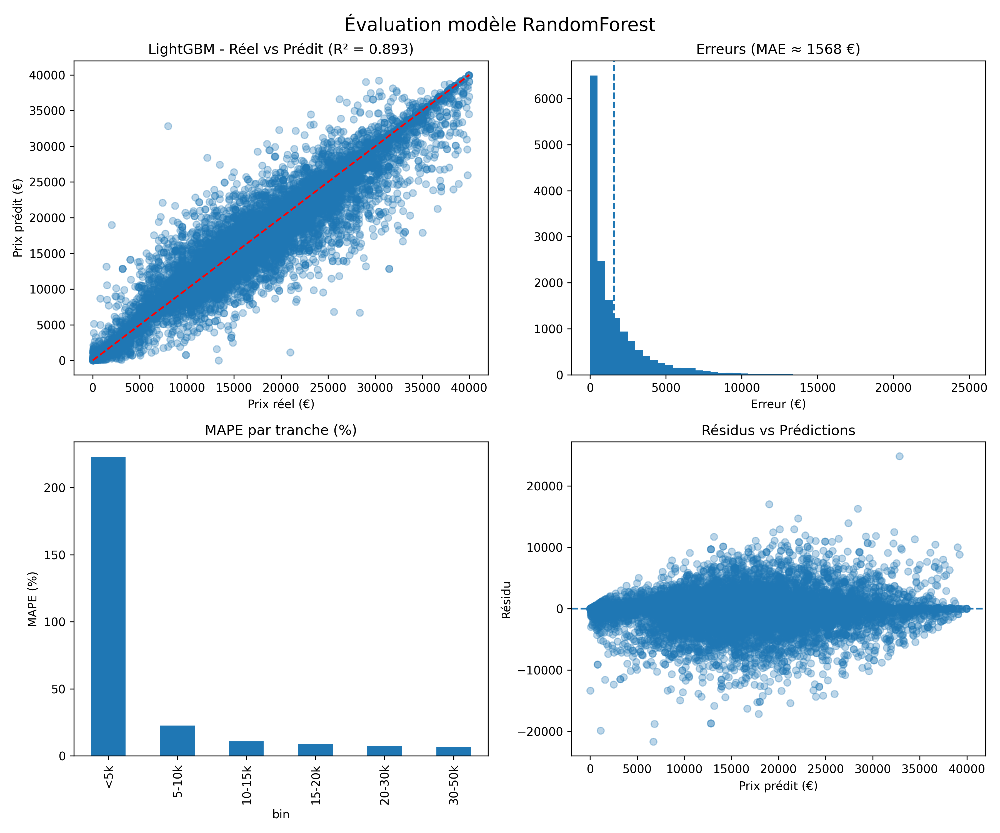

# Estimation Prix Véhicule d'Occasion

Application complète de machine learning pour estimer le prix de reprise d'un véhicule d'occasion, déployée sur Google Cloud Platform via Docker et accessible depuis une interface web.

---

## Aperçu

| | |
|---|---|
| **Modèle retenu** | Random Forest (150 arbres, profondeur 30) |
| **RMSE** | 2 612 € |
| **R²** | 0.89 |
| **MAE** | ≈ 1 568 € |
| **Déploiement** | Google Cloud VM + Docker + FastAPI |
| **Accès** | http://34.38.175.44:6260 |

---

## Structure du projet

```
├── modele_prix_clean.ipynb     # Notebook principal (feature engineering + entraînement)
├── vente_vehicule_2026.csv     # Données d'entraînement
├── rf_evaluation.png           # Graphiques d'évaluation Random Forest
├── LGBM_evaluation.png         # Graphiques d'évaluation LightGBM
├── README.md
│
├── Api/
│   ├── main.py                 # API FastAPI
│   ├── model_rf.pkl            # Modèle + encodeurs sauvegardés
│   ├── requirements.txt
│   ├── Dockerfile
│   └── frontend/
│       └── index.html          # Interface web
│
├── Documents/
│   └── Rapport_final.docx      # Rapport complet du projet
│
└── Tests/
    └── test_app.py
```

---

## Fonctionnement

### 1. Feature Engineering

Le feature engineering est l'étape la plus déterminante — il divise le RMSE par plus de 2 (de 5 720 € à 2 612 €).

**Variables créées :**

| Variable | Formule | Rôle |
|---|---|---|
| `age_veh` | `annee_facture - annee` | Usure réelle du véhicule |
| `km_par_an` | `kilometrage / (age_veh + 1)` | Intensité d'utilisation |
| `log_km` | `log1p(kilometrage)` | Lissage des valeurs extrêmes |
| `age_squared` | `age_veh ** 2` | Non-linéarité de la décote |
| `log_age` | `log1p(age_veh)` | Lissage de l'effet âge |
| `age_x_km` | `age_veh * kilometrage` | Interaction usure × kilométrage |
| `puissance_x_age` | `puissance * age_veh` | Interaction puissance × âge |
| `puissance` | Regex sur le nom du modèle | Finition / version |
| `is_sport` | Détection GTI, RS, SPORT | Versions sportives |
| `is_premium` | Détection BUSINESS, EXECUTIVE | Versions haut de gamme |

**Encodage catégoriel (Target Encoding) :**

Toutes les variables catégorielles (`marque`, `carburant`, `energie`, `modele_simple`) sont encodées par **target encoding** : chaque catégorie est remplacée par la moyenne des prix observés dans le jeu d'entraînement. Les dictionnaires d'encodage sont sauvegardés dans le fichier `model_rf.pkl` pour garantir la cohérence entre l'entraînement et l'inférence via l'API.

### 2. Modèles comparés

| Modèle | RMSE (€) | R² | Temps | Décision |
|---|---|---|---|---|
| **Random Forest** ★ | **2 612** | **0.89** | 44 sec | **Retenu** |
| LightGBM | 2 800 | 0.87 | 27 sec | Non retenu |
| MLP | > 5 000 | < 0.80 | 102 sec | Non retenu |

### 3. API FastAPI

L'API expose deux routes principales :

- `GET /marques` — retourne la liste des marques disponibles
- `POST /predict` — retourne le prix estimé et l'intervalle de confiance

**Exemple de requête :**

```bash
curl -X POST http://34.38.175.44:6260/predict \
  -H "Content-Type: application/json" \
  -d '{
    "marque": "CITROEN",
    "modele": "C4 Picasso 1.6 HDi",
    "annee": 2018,
    "annee_facture": 2025,
    "kilometrage": 80000,
    "energie": "Thermique",
    "carburant": "Diesel"
  }'
```

**Réponse :**

```json
{
  "prix_estime": 12450.00,
  "std": 980.50,
  "intervalle": {
    "bas": 10527.18,
    "haut": 14372.82
  }
}
```

L'intervalle de confiance à 95 % est calculé à partir de la variance entre les arbres du Random Forest (`± 1.96 × écart-type`).

---

## Déploiement

### Prérequis

- Docker
- Python 3.9+

### Lancer l'API en local

```bash
cd Api/
pip install -r requirements.txt
uvicorn main:app --host 0.0.0.0 --port 6260
```

### Lancer via Docker

```bash
cd Api/
docker build -t mon_api_remy .
docker run -d -p 6260:6260 mon_api_remy
```

L'interface web est ensuite accessible sur `http://localhost:6260`.

---

## Résultats



---

## Technologies

- **Python 3.9** — scikit-learn, pandas, numpy, LightGBM
- **FastAPI + Uvicorn** — API REST
- **Docker** — containerisation
- **Google Cloud Platform** — déploiement VM
- **JupyterLab** — environnement de développement
